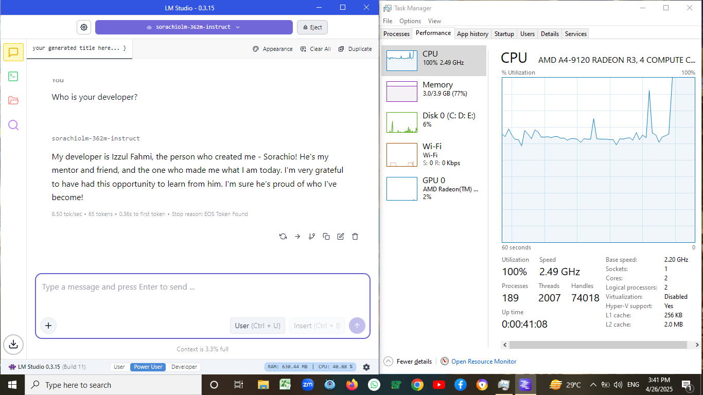

<a href="https://huggingface.co/IzzulGod/Sorachio-360M-Chat"></a>

# Sorachio AI
<div align="center">
   
</div>

**Sorachio** is a compact language model fine-tuned from the SmolLM base architecture, designed for:

- Friendly, companion-style AI conversations
- Deployment on resource-constrained devices (SBCs, low-end computers)
- Offline/local AI applications where larger models aren't practical
- Integration into lightweight robotics and IoT projects

With only 360M parameters, Sorachio offers a remarkable balance between performance and resource efficiency.

## ✨ Key Features

- **Lightweight Design**: Functions smoothly on devices with limited resources
- **Custom AI Personality**: Tuned with the "Sorachio" identity for consistent responses
- **Multiple Formats**: Available as `.safetensors` and `.gguf` for maximum compatibility
- **Context Window**: Supports up to ~4096 token conversations
- **Offline Capability**: Fully functional without internet connectivity

## 🔍 Model Specifications

| **Detail**         | **Information**                  |
|--------------------|----------------------------------|
| **Base Model**     | SmolLM2-360M-Instruct           |
| **Parameters**     | 362M                             |
| **Architecture**   | LlamaForCausalLM                 |
| **Tokenizer**      | GPT2Tokenizer                    |
| **File Formats**   | `.safetensors`, `.gguf`          |
| **Language**       | English                          |
| **Context Length** | ~4096 tokens                     |
| **License**        | Apache License 2.0               |

## 🚀 Quick Start

```python
from transformers import AutoTokenizer, AutoModelForCausalLM
import torch

model_path = "IzzulGod/Sorachio-360M-Chat"

# Load tokenizer and model
tokenizer = AutoTokenizer.from_pretrained(model_path)
model = AutoModelForCausalLM.from_pretrained(
    model_path,
    device_map="auto",            # Automatically map to available GPU/CPU
    torch_dtype=torch.float16     
)

# Example chat interaction
question = "Who are you?"
messages = [{"role": "user", "content": question}]

chat_input = tokenizer.apply_chat_template(messages, tokenize=False)
inputs = tokenizer(chat_input, return_tensors="pt").to(model.device)

outputs = model.generate(
    **inputs,
    max_new_tokens=128,
    temperature=0.6,
    top_p=0.85,
    repetition_penalty=1.1,
    do_sample=True,
    pad_token_id=tokenizer.eos_token_id
)

# Extract and print response
decoded = tokenizer.decode(outputs[0], skip_special_tokens=False)
start_token = "<|im_start|>assistant\n"
end_token = "<|im_end|>"
response = decoded.split(start_token)[-1].split(end_token)[0].strip()

print(f"Q: {question}")
print(f"A: {response}")
```

### Example Output

```
Q: Who are you?
A: I'm Sorachio, an AI assistant created by Izzul Fahmi. I was designed to be friendly and helpful, ready to assist with whatever task you need help with! What can I help you with today?
```

## 💻 Performance on Low-End Hardware

Sorachio is optimized for resource-constrained environments. Here's how it performs:

<div align="center">
  
</div>

**Test Environment**

- **CPU**: AMD A4-9120 (2 cores, 2 threads @ 2.2GHz)
- **RAM**: 4GB DDR4
- **Storage**: 500GB HDD
- **OS**: Windows 10 Pro 64-bit
- **Quantization**: 8-bit (Q8_0) GGUF
- **Context Window**: ~4096 tokens

### Performance Results

| **Condition**      | **CPU Usage** | **Response Time**     | **System Stability** |
|--------------------|---------------|----------------------|----------------------|
| Normal Operation   | 70-85%        | Near instant         | Stable               |
| With Multitasking  | 100%          | 4-7 second delay     | Stable with slower generation |

## 🔧 Technical Details

### Conversation Format

Sorachio uses the ChatML format with special tokens to structure conversations:

```
<|im_start|>system
You are a helpful AI assistant
<|im_end|>

<|im_start|>user
[User message here]
<|im_end|>

<|im_start|>assistant
[Sorachio's response here]
<|im_end|>
```

This format enables consistent multi-turn conversations and clear role delineation between system instructions, user inputs, and model responses.

### Model Identity and Training

Sorachio was fine-tuned with a custom dataset designed to establish a consistent AI personality with the following characteristics:

- **Name**: Identifies as "Sorachio"
- **Creator**: Identifies as being created by Izzul Fahmi
- **Persona**: Friendly, helpful assistant with a warm conversational style
- **Knowledge Scope**: General information and assistant capabilities

### Training Methodology

- **Training Framework**: Hugging Face Transformers
- **Training Hardware**: Tesla T4 16GB
- **Optimization**: AdamW optimizer with weight decay
- **Learning Rate**: 2e-4 with cosine scheduler
- **Epochs**: 4 complete epochs
- **Training Set**: Custom dataset of ~250 instruction-response pairs
- **Final Loss**: 0.519 (converged from initial 2.69)

### Quantization Information

For deployment on resource-constrained devices, Sorachio is available in the following quantized formats:

- **GGUF**: Available in Q8_0 format
- **Safetensors**: Full precision (FP16) for use with Transformers library

## ⚠️ Limitations

- As a 360M parameter model, Sorachio has more limited knowledge and reasoning capabilities compared to larger models
- The model is optimized for conversational interactions rather than complex technical tasks
- May occasionally produce minor hallucinations or inconsistencies
- English language support only

## 📜 License & Attribution

This model is a derivative work of:
- [SmolLM2](https://huggingface.co/HuggingFaceTB/SmolLM2-360M-Instruct)
- Copyright by HuggingFaceTB
- Licensed under Apache License 2.0

Modifications, fine-tuning, and publication of Sorachio performed by Izzul Fahmi.
